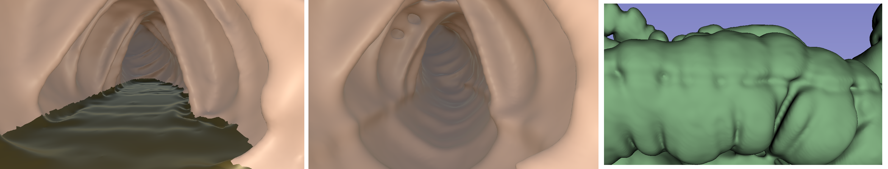

# GeometricalColonSeg
A pipeline developed for project Xavier for colon segmentation with the goal of improving VR colonography.


## Requirements
To run this program, ensure you have the following Python libraries installed:

- `nibabel`
- `numpy`
- `scipy`
- `cv2`
- `medpy`

You can install these libraries using pip:
```bash
pip install nibabel numpy scipy opencv-python medpy
```

## How It Works
1. **Input**:
   - The program will prompt you to provide the file path to a `.nii` image.
   
2. **Processing**:
   - Once the file path is provided, the program processes the `.nii` image.

3. **Output**:
   - The processed output is written in the same directory as the `.py` script.
   - The output file will have the same name as the input but will end with `_Seg.nii` instead of `.nii`.


